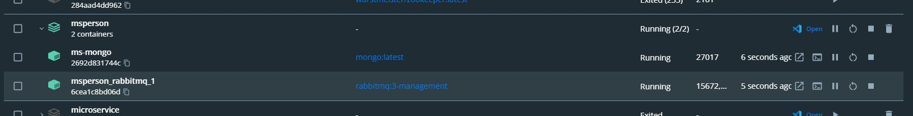
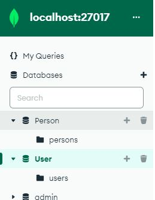
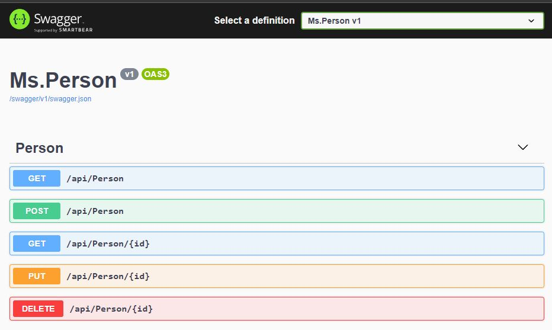
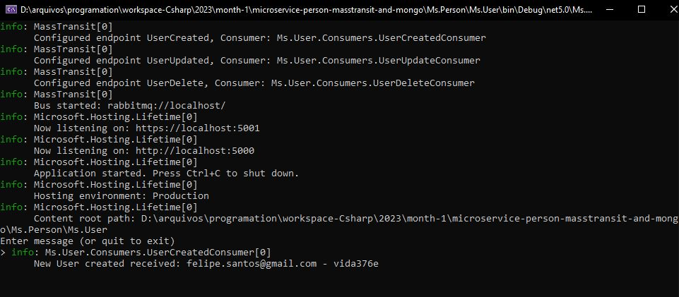

## <h1> People Registration Microservices with RabbitMQ Messaging </h1>  
 

<h2>Description English</h2>

With the people registration application that uses RabbitMQ and MassTransit,
  you can be confident that your data will be updated in real time in another Microservice
  of User with its own Database. Don't waste any more time with spreadsheets and physical documents,
  have an efficient and secure system to manage your records and optimize your processes.
  Person registration application, where you can register a new person, and this registration
  and forwarded to another User Microservice with RabbitMQ and MassTransit,
where this other user who also has their own Database is updated or registered.

<h2>Descrição Português</h2>

Com a aplicação de cadastro de pessoas que utiliza RabbitMQ e MassTransit,
 você pode ter certeza de que seus dados serão atualizados em tempo real em outro Microsserviço
 de Usuário com Banco de Dados próprio. Não perca mais tempo com planilhas e documentos físicos,
 tenha um sistema eficiente e seguro para gerenciar seus cadastros e otimize seus processos.
 Aplicação de cadastro de pessoas, onde você pode cadastrar uma nova pessoa, e este cadastro
 e encaminhado para outro Microsserviço de Usuário com RabbitMQ e MassTransit,
onde este outro usuario que também têm um Banco de Dados próprio é atualizado ou cadastrado.

<h4>How To Run</h4>

To run the project Just access the Ms.Person folder and type in the terminal
"docker-compose up"
and right after running the Ms.User and Ms.Person projects, the Ms.Person service and the producer
and the Ms.User and the consumer.
Therefore, when you perform an Update or Registration or Deletion in the Ms.Person application, the application
Ms.User will be changed as well.

<h4>Como rodar o Project</h4>
Para rodar o projeto Basta acessar a pasta Ms.Person e digitar no terminal
"docker-compose up"
e logo apos executar os projetos Ms.User e Ms.Person o serviço Ms.Person e o produtor
e o Ms.User e o consumidor.
Sendo assim quando você faz um Update ou Cadastro ou Deleção na aplicação Ms.Person a aplicação
Ms.User vai ser alterada também.

Whole Application: 

Containers: 

Banco de Dados: 

Ms.Employee: 

Ms.User: 

 
## 🚀 Tech Usada 
 
- C# .NET 
- Banco de Dados MongoDb 
- Mensageria RabbitMQ 
- HATEOAS 
- Clean Code 
- MassTransit 
-   Docker 
-   Swagger  

 

## Linkedin Below - Linkedin ABaixo

<h4 align="center">
   Created by   <a href="https://www.linkedin.com/in/luiz-carlos-b50693173/" target="_blank"> Luiz Carlos </a>
</h4>

</html>
